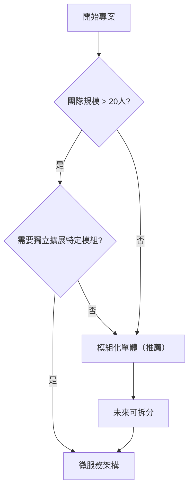
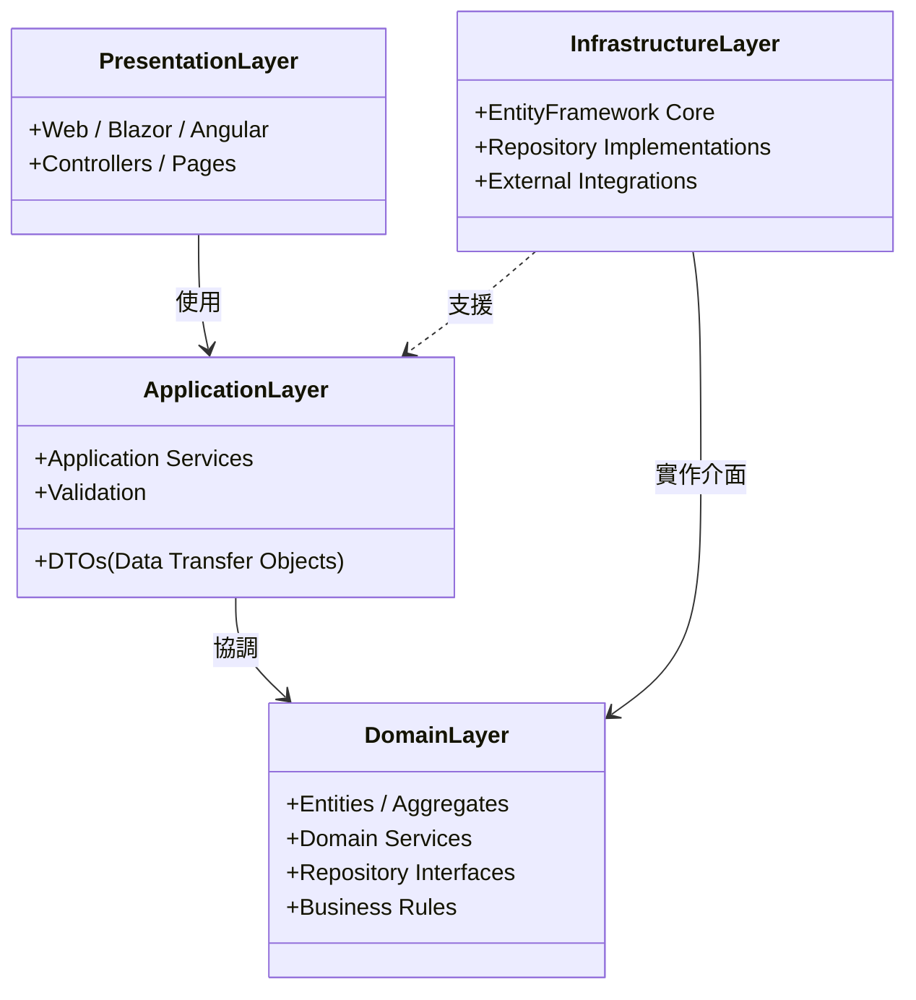
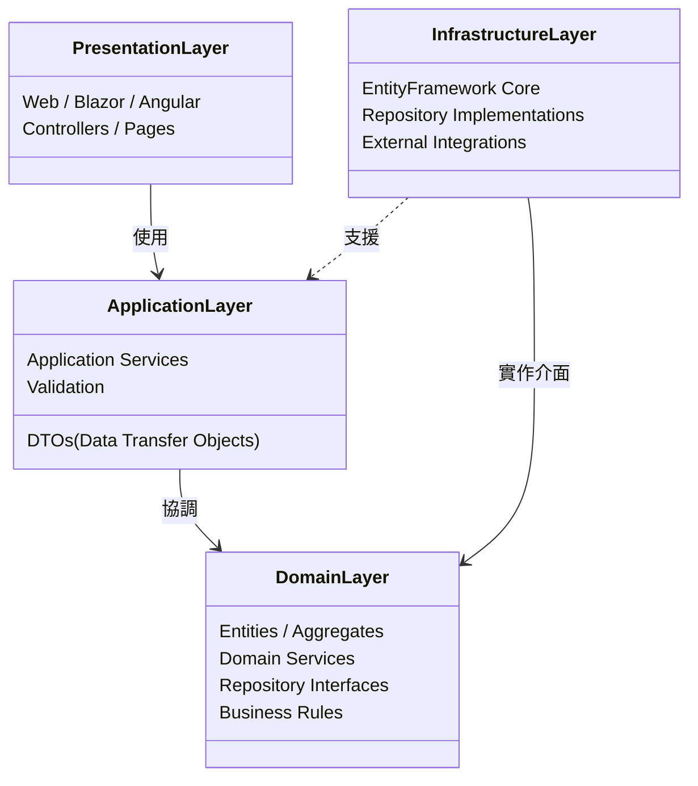

# 第一章：現代軟體開發與 ABP Framework

## 1.1 引言：軟體開發的現代挑戰

在當今快速變化的技術環境中，軟體開發團隊面臨著前所未有的挑戰。企業不再僅僅要求軟體「能運作」，更要求具備**高可維護性**、**可擴展性**以及**快速上市（Time-to-Market）**的能力。

現代開發者常面臨以下痛點：

- **重複造輪子**：每個專案都要重新實作權限管理、日誌記錄、例外處理等基礎設施。
- **架構腐化**：隨著業務邏輯增長，專案結構逐漸混亂，導致「義大利麵條式程式碼（Spaghetti Code）」。
- **技術債累積**：缺乏統一的規範與最佳實踐，導致團隊協作困難，新成員上手緩慢。
- **微服務轉型困難**：從單體架構過渡到微服務架構時，面臨巨大的技術鴻溝。

**ABP Framework** 正是為了這些問題而生。它不僅是一個框架，更是一套完整的**軟體開發最佳實踐指南**。

---

## 1.2 什麼是 ABP Framework？

ABP Framework 是一個基於 **ASP.NET Core** 的開源 Web 應用程式框架，專為建立現代化 Web 應用程式和 API 而設計。它遵循 **領域驅動設計（DDD）** 原則，並內建了許多企業級應用所需的基礎功能。

### 核心理念

1.  **DRY (Don't Repeat Yourself)**：自動化常見任務（如 CRUD API、資料庫遷移、前端代理生成）。
2.  **約定優於配置 (Convention Over Configuration)**：提供合理的預設值，減少繁瑣的設定，但保留高度可自訂性。
3.  **模組化 (Modularity)**：將應用程式拆分為獨立的模組，每個模組包含自己的資料庫結構、API 和 UI，便於重用與維護。
4.  **領域驅動設計 (DDD)**：提供實體（Entities）、聚合根（Aggregate Roots）、倉儲（Repositories）、領域服務（Domain Services）等基礎類別，強制落實分層架構。

### ABP V10.0 (社群版) 重點更新

ABP V10.0 帶來了多項改進，特別是在開發者體驗與現代化前端支援上：

- **Angular 20 支援**：全面升級至 Angular 20，並支援 Standalone Component 架構，提升前端效能與開發效率。
- **Blazorise 1.7.7**：Blazor UI 元件庫更新，提供更豐富的元件與修復。
- **文件 PDF 匯出**：Docs 模組新增 PDF 匯出功能，方便製作離線文件。
- **背景工作增強**：支援 Cron 表達式排程，讓背景任務管理更靈活。
- **效能優化**：RabbitMQ 客戶端升級至 7.x，全面支援非同步操作；EF Core MySQL 提供者切換至 `MySql.EntityFrameworkCore` 以獲得更好支援。

---

## 1.3 架構選型：單體 vs. 微服務

ABP Framework 的一大優勢是**架構靈活性**。它支援從模組化單體（Modular Monolith）平滑過渡到微服務架構。

### 架構比較表

| 特性           | 單體架構 (Monolith) | 模組化單體 (Modular Monolith) | 微服務架構 (Microservices)      |
| :------------- | :------------------ | :---------------------------- | :------------------------------ |
| **部署單位**   | 單一執行檔/容器     | 單一執行檔/容器               | 多個獨立服務                    |
| **開發複雜度** | 低                  | 中                            | 高                              |
| **維運成本**   | 低                  | 低                            | 高 (需 K8s, Service Mesh 等)    |
| **資料隔離**   | 共享資料庫          | 邏輯隔離 (Schema/Table 前綴)  | 實體隔離 (Database per Service) |
| **適用場景**   | 小型專案、MVP       | 中大型企業應用 (推薦起點)     | 超大規模、高併發、多團隊協作    |

### 決策樹



**最佳實踐建議**：
對於大多數專案，建議從 **模組化單體** 開始。利用 ABP 的模組系統，將業務邊界劃分清楚（例如：產品模組、訂單模組、客戶模組）。當某個模組負載過高或需要獨立技術堆疊時，再將其拆分為獨立的微服務。ABP 的架構設計使得這種拆分變得相對容易，因為業務邏輯已經與基礎設施解耦。

---

## 1.4 ABP 分層架構解析

ABP 嚴格遵循 DDD 分層架構，確保關注點分離。





1.  **領域層 (Domain Layer)**：

    - 核心業務邏輯所在。
    - 包含實體 (Entities)、值物件 (Value Objects)、聚合根 (Aggregate Roots)。
    - **不依賴** 其他層（除了共用核心庫）。
    - 定義倉儲介面 (Repository Interfaces)。

2.  **應用層 (Application Layer)**：

    - 協調領域物件以完成使用案例（Use Cases）。
    - 包含應用服務 (Application Services) 和 DTOs。
    - 負責權限驗證、輸入驗證、交易控制（Unit of Work）。
    - **不包含** 核心業務規則。

3.  **基礎設施層 (Infrastructure Layer)**：

    - 實作領域層定義的介面。
    - 包含資料庫存取 (EF Core)、發送 Email、檔案儲存等具體技術實作。

4.  **展示層 (Presentation Layer)**：
    - 使用者介面 (MVC Views, Razor Pages, Angular, Blazor)。
    - HTTP API 控制器 (ABP 可自動將 AppService 暴露為 API)。

---

## 1.5 實戰：建立您的第一個 ABP 專案

本節將引導您安裝 ABP CLI 並建立一個名為 `BookStore` 的範例專案。

### 步驟 1：環境準備

確保您已安裝：

- **.NET 10.0 SDK** (或符合 ABP V10.0 要求的版本)
- **Node.js** (若使用 Angular/React 前端)
- **IDE**: Visual Studio 2022 或 VS Code

### 步驟 2：安裝 ABP CLI

開啟終端機 (PowerShell 或 Bash)，執行以下指令安裝 ABP 全域工具：

```bash
dotnet tool install -g Volo.Abp.Cli
```

驗證安裝：

```bash
abp --version
```

### 步驟 3：建立解決方案

我們將建立一個包含 MVC UI 和 Entity Framework Core 的專案。

```bash
# 建立名為 BookStore 的專案
# -t app: 專案類型為 Application
# -u mvc: UI 框架使用 ASP.NET Core MVC
# -d ef: 資料庫提供者使用 Entity Framework Core
abp new BookStore -t app -u mvc -d ef
```

### 步驟 4：專案結構導覽

建立完成後，進入 `BookStore` 目錄，您會看到以下結構：

- **src/**：原始程式碼
  - `BookStore.Domain`：領域層
  - `BookStore.Application`：應用層
  - `BookStore.EntityFrameworkCore`：EF Core 設定與遷移
  - `BookStore.Web`：MVC 前端與 API Host
  - `BookStore.DbMigrator`：資料庫遷移工具 (Console App)
- **test/**：測試專案
  - 包含單元測試與整合測試範本。

### 步驟 5：執行專案

1.  **執行資料庫遷移**：
    ABP 專案通常附帶一個 `DbMigrator` 專案，用於初始化資料庫與種子資料 (Seed Data)。

    ```bash
    cd src/BookStore.DbMigrator
    dotnet run
    ```

    _成功後，資料庫將被建立並包含預設的 Admin 使用者與權限設定。_

2.  **啟動 Web 應用**：

    ```bash
    cd ../BookStore.Web
    dotnet run
    ```

3.  **瀏覽網站**：
    打開瀏覽器訪問 `https://localhost:443xx` (具體埠號請見啟動日誌)。
    使用預設帳號登入：
    - 帳號：`admin`
    - 密碼：`1q2w3E*` (請參考專案中的說明文件，通常在第一次執行時會顯示或在 `appsettings.json` 中設定種子密碼規則)

---

## 1.6 常見問題與故障排除 (Troubleshooting)

| 問題                        | 可能原因                         | 解決方案                                                                    |
| :-------------------------- | :------------------------------- | :-------------------------------------------------------------------------- |
| **`abp` command not found** | PATH 環境變數未更新              | 重啟終端機或手動將 `.dotnet/tools` 加入 PATH。                              |
| **資料庫連線失敗**          | 連線字串錯誤或 SQL Server 未啟動 | 檢查 `appsettings.json` 中的 `Default` 連線字串，確保 SQL Server 正在執行。 |
| **版本不相容**              | CLI 版本與專案範本版本不一致     | 執行 `abp update` 更新 CLI，或在 `abp new` 時指定版本 `--version 10.0.0`。  |
| **前端樣式跑版**            | NPM 套件未安裝 (Blazor/MVC)      | 在 Web 專案目錄下執行 `abp install-libs` 安裝前端依賴。                     |

---

## 1.7 練習與挑戰

為了鞏固本章所學，請完成以下練習：

### 基礎練習

1.  **環境建置**：成功安裝 .NET SDK, ABP CLI。
2.  **專案建立**：建立一個名為 `TaskManager` 的新專案 (MVC + EF Core)。
3.  **運行驗證**：成功執行 DbMigrator 並登入 `TaskManager` 網站。

### 進階挑戰

1.  **探索模組**：在 `TaskManager` 專案中，找到 `TaskManager.Domain` 專案，並建立一個名為 `TodoItem` 的實體類別 (Entity)，包含 `Title` (string) 和 `IsCompleted` (bool) 屬性。
2.  **架構思考**：繪製一張圖，說明當使用者在瀏覽器點擊「完成任務」按鈕時，請求如何流經 ABP 的各個分層 (Controller -> AppService -> Repository -> Database)。

---

## 1.8 總結

本章介紹了 ABP Framework 如何透過模組化與 DDD 幫助開發者應對現代軟體挑戰。我們學習了：

- ABP 的核心價值：DRY、DDD、模組化。
- 架構選型的策略：從模組化單體開始。
- 如何使用 CLI 快速建立並運行一個標準專案。

在下一章中，我們將深入探討 **ABP 的基礎設施**，學習如何定義實體、設定資料庫對應以及使用 Repository 模式進行資料存取。

---

**參考資源**：

- [ABP 官方文件](https://docs.abp.io/)
- [ABP GitHub 倉庫](https://github.com/abpframework/abp)
