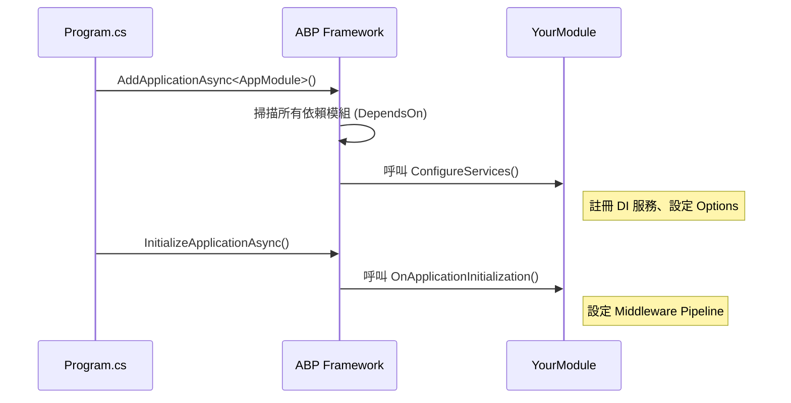

# 第二章：ABP Framework 快速入門

## 2.1 引言

在第一章中，我們了解了 ABP Framework 的核心理念與架構優勢。現在，是時候捲起袖子，實際動手打造我們的第一個應用程式了。本章將帶您走過從環境建置、專案建立、結構解析到成功運行的完整流程。

---

## 2.2 開發環境準備

在開始之前，請確保您的開發環境已滿足以下需求。ABP V10.0 基於最新的 .NET 技術堆疊。

### 必要工具

1.  **.NET 10.0 SDK**：

    - 下載連結：[https://dotnet.microsoft.com/download/dotnet/10.0](https://dotnet.microsoft.com/download/dotnet/10.0)
    - 驗證指令：`dotnet --version`

2.  **Node.js (LTS 版本)**：

    - 用於前端開發 (Angular/React/Vue) 與樣式編譯。
    - 下載連結：[https://nodejs.org/](https://nodejs.org/)
    - 驗證指令：`node -v`

3.  **IDE (整合開發環境)**：

    - **Visual Studio 2022** (推薦 Windows 使用者，需更新至最新版以支援 .NET 10)。
    - **Visual Studio Code** (跨平台推薦，需安裝 C# Dev Kit 擴充套件)。
    - **JetBrains Rider** (強大的跨平台 .NET IDE)。

4.  **Docker Desktop** (選用，但強烈推薦)：
    - 用於快速啟動資料庫 (SQL Server, PostgreSQL, Redis) 與其他基礎設施。

---

## 2.3 深入 ABP CLI

ABP CLI (Command Line Interface) 是開發 ABP 應用程式的瑞士刀。

### 常用指令詳解

| 指令             | 描述                    | 範例                                |
| :--------------- | :---------------------- | :---------------------------------- |
| `new`            | 建立新解決方案          | `abp new BookStore`                 |
| `update`         | 更新專案的 ABP 套件版本 | `abp update`                        |
| `add-package`    | 安裝 ABP 模組或套件     | `abp add-package Volo.Abp.Emailing` |
| `add-module`     | 將現有模組加入解決方案  | `abp add-module Volo.CmsKit`        |
| `generate-proxy` | 產生前端 API 代理程式碼 | `abp generate-proxy -t ng`          |
| `help`           | 查看幫助文件            | `abp help new`                      |

### `abp new` 的關鍵參數

- `-t` / `--template`: 指定範本類型。
  - `app`: 標準應用程式 (預設)。
  - `module`: 建立可重用的模組。
  - `microservice`: 微服務範本 (通常需商業版或自行組裝)。
- `-u` / `--ui`: 指定 UI 框架。
  - `mvc`: ASP.NET Core MVC / Razor Pages (預設)。
  - `blazor`: Blazor Server。
  - `blazor-wasm`: Blazor WebAssembly。
  - `angular`: Angular。
- `-d` / `--database`: 指定資料庫提供者。
  - `ef`: Entity Framework Core (預設)。
  - `mongodb`: MongoDB。
- `--mobile`: 指定行動端框架 (如 `maui`, `react-native`)。

---

## 2.4 專案結構完全解析

當您執行 `abp new BookStore` 後，會得到一個多層次的專案結構。這可能會讓初學者感到困惑，但每個專案都有其明確的職責。

### 解決方案結構樹

```text
BookStore/
├── src/
│   ├── BookStore.Domain.Shared/      # [所有層] 共用的常數、列舉、本地化資源
│   ├── BookStore.Domain/             # [領域層] 實體、聚合根、領域服務、Repository 介面
│   ├── BookStore.Application.Contracts/ # [應用層] DTOs、應用服務介面
│   ├── BookStore.Application/        # [應用層] 應用服務實作、Mapper 設定
│   ├── BookStore.EntityFrameworkCore/# [基礎設施層] DbContext、Repository 實作、EF Core 設定
│   ├── BookStore.HttpApi/            # [介面層] API Controllers (通常由 ABP 自動生成，可手動覆寫)
│   ├── BookStore.HttpApi.Client/     # [客戶端] C# HTTP Client 代理 (供其他微服務或 Console App 呼叫)
│   └── BookStore.Web/                # [介面層] MVC/Razor Pages UI、啟動專案 (Host)
├── test/                             # 測試專案 (對應 src 中的各層)
└── common.props                      # MSBuild 共用設定
```

### 為什麼要分這麼細？

1.  **Domain.Shared vs Domain**：`Domain` 依賴 `Domain.Shared`。`Domain.Shared` 存放可以安全分享給客戶端 (如 Blazor WebAssembly) 的程式碼，例如 `Enum` 或錯誤碼常數，而 `Domain` 包含核心邏輯，不應暴露給客戶端。
2.  **Application.Contracts vs Application**：`Contracts` 定義介面 (Interfaces) 和 DTOs。這允許我們將 `Contracts` 分發給需要呼叫此服務的客戶端，而無需洩漏實作細節。
3.  **HttpApi vs Web**：`HttpApi` 包含 API 定義，`Web` 包含 UI 頁面。在微服務架構中，`HttpApi` 可以被獨立託管，而 `Web` 僅作為 Gateway 或前端。

---

## 2.5 ABP 的啟動流程與模組系統

ABP 是一個高度模組化的框架。每個專案都有一個繼承自 `AbpModule` 的類別，這是模組的入口。

### 模組類別結構

```csharp
[DependsOn(
    typeof(AbpAspNetCoreMvcModule), // 依賴的其他模組
    typeof(BookStoreApplicationModule),
    typeof(BookStoreEntityFrameworkCoreModule)
)]
public class BookStoreWebModule : AbpModule
{
    // 1. 設定服務 (類似 Startup.ConfigureServices)
    public override void ConfigureServices(ServiceConfigurationContext context)
    {
        var configuration = context.Services.GetConfiguration();

        Configure<AbpLocalizationOptions>(options => { ... });
        Configure<AbpAspNetCoreMvcOptions>(options => { ... });
    }

    // 2. 應用程式初始化 (類似 Startup.Configure)
    public override void OnApplicationInitialization(ApplicationInitializationContext context)
    {
        var app = context.GetApplicationBuilder();
        var env = context.GetEnvironment();

        app.UseStaticFiles();
        app.UseRouting();
        app.UseConfiguredEndpoints();
    }
}
```

### 啟動順序圖



---

## 2.6 依賴注入 (Dependency Injection)

ABP 建立在 .NET Core 的 DI 之上，並引入了自動註冊機制。您不需要手動在 `ConfigureServices` 中一行行註冊服務。

### 自動註冊介面

只要實作以下介面，ABP 就會自動將您的類別註冊到 DI 容器：

- **ITransientDependency**：每次請求建立新實例 (預設)。
- **ISingletonDependency**：整個應用程式生命週期共用一個實例。
- **IScopedDependency**：每個 HTTP 請求共用一個實例。

**範例**：

```csharp
public class TaxCalculator : ITaxCalculator, ITransientDependency
{
    public decimal Calculate(decimal price)
    {
        return price * 1.05m;
    }
}
```

現在，您可以在任何地方透過建構式注入 `ITaxCalculator`。

---

## 2.7 實戰演練：Hello World API

讓我們在 `BookStore` 專案中加入一個簡單的 API。

### 步驟 1：定義介面 (Application.Contracts)

在 `BookStore.Application.Contracts` 專案中，新增 `IHelloWorldAppService.cs`：

```csharp
using Volo.Abp.Application.Services;

namespace BookStore
{
    public interface IHelloWorldAppService : IApplicationService
    {
        string GetMessage();
    }
}
```

### 步驟 2：實作服務 (Application)

在 `BookStore.Application` 專案中，新增 `HelloWorldAppService.cs`：

```csharp
using Volo.Abp.Application.Services;

namespace BookStore
{
    public class HelloWorldAppService : ApplicationService, IHelloWorldAppService
    {
        public string GetMessage()
        {
            return "Hello from ABP V10.0!";
        }
    }
}
```

### 步驟 3：執行並測試

1.  執行 `BookStore.Web` 專案。
2.  瀏覽器打開 Swagger UI (通常是 `/swagger`)。
3.  您會發現 ABP **自動**將 `HelloWorldAppService` 暴露為 API 端點：`GET /api/app/hello-world`。
4.  點擊 "Try it out" -> "Execute"，您將看到回應 "Hello from ABP V10.0!"。

這就是 ABP 的魔力：**您只需專注於應用服務邏輯，API 控制器會自動生成。**

---

## 2.8 練習與作業

### 基礎練習

1.  **修改首頁**：找到 `BookStore.Web/Pages/Index.cshtml`，修改歡迎訊息為 "歡迎來到我的書店"。
2.  **新增設定**：在 `appsettings.json` 中新增一個自訂區段 `"BookStoreSettings": { "MaxBooks": 100 }`，並嘗試在 AppService 中讀取它 (提示：使用 `IConfiguration`)。

### 進階挑戰

1.  **手動控制器**：嘗試在 `BookStore.HttpApi` 專案中建立一個標準的 ASP.NET Core Controller，並注入 `IHelloWorldAppService` 來回傳資料。這能幫助您理解 ABP 自動 API 與傳統 Controller 的並存關係。

---

## 2.9 常見問題 (FAQ)

**Q: 為什麼我看不到 Swagger 頁面？**
A: 確保您是在 `Development` 環境下執行。檢查 `launchSettings.json` 中的 `ASPNETCORE_ENVIRONMENT` 變數。

**Q: 執行 DbMigrator 時發生 "Certificate Chain Errors"？**
A: 這通常發生在開發環境的 SQL Server。可以在連線字串中加入 `TrustServerCertificate=True`。

**Q: 修改了 AppService 介面，但 Swagger 沒更新？**
A: 嘗試重新建置整個解決方案，或重啟 Web 專案。ABP 的動態 API 控制器是在啟動時生成的。

---

## 2.10 總結

在本章中，我們：

1.  安裝了 ABP CLI 並建立了 `BookStore` 專案。
2.  剖析了 ABP 的分層專案結構。
3.  學習了模組化啟動流程與依賴注入系統。
4.  實作了一個自動暴露為 API 的應用服務。

下一章，我們將進入 **實戰應用程式開發流程**，學習如何規劃一個真實的功能模組，並繪製流程圖。

---

**參考資源**：

- [ABP CLI 文件](https://docs.abp.io/en/abp/latest/CLI)
- [ABP 模組系統](https://docs.abp.io/en/abp/latest/Module-Development-Basics)
