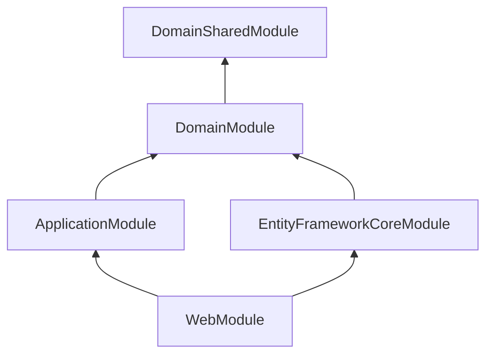

# 第五章：ASP.NET Core 與 ABP 架構深入解析

## 5.1 引言：站在巨人的肩膀上

ABP Framework 並不是要取代 ASP.NET Core，而是建立在其之上。它利用了 ASP.NET Core 的 **依賴注入 (DI)**、**中介軟體 (Middleware)** 與 **配置 (Configuration)** 系統，並透過一套強大的 **模組化 (Modularity)** 機制將其組織起來。

本章將帶您深入引擎蓋下方，了解 ABP 是如何運作的。

---

## 5.2 模組化系統 (Modularity)

在 ASP.NET Core 中，我們通常在 `Startup.cs` 或 `Program.cs` 中註冊服務。但在 ABP 中，這些邏輯被分散到了各個 **模組 (Module)** 中。

### 模組生命週期

一個 ABP 應用程式的啟動過程可以分為兩個主要階段：

1.  **服務註冊 (ConfigureServices)**：

    - 對應 `IServiceCollection`。
    - 在此階段，模組會註冊自己的服務、設定 Options、以及加入 DbContext。
    - **關鍵方法**：`ConfigureServices`, `PreConfigureServices`, `PostConfigureServices`。

2.  **應用程式初始化 (OnApplicationInitialization)**：
    - 對應 `IApplicationBuilder`。
    - 在此階段，模組會設定 Middleware Pipeline、執行資料庫遷移、或啟動背景工作。
    - **關鍵方法**：`OnApplicationInitialization`, `OnApplicationShutdown`。

### 模組依賴圖

ABP 會自動解析 `[DependsOn]` 屬性，並建立一個依賴圖 (Dependency Graph)。啟動時，它會依照 **拓撲排序 (Topological Sort)** 的順序來執行每個模組的生命週期方法。



- **啟動順序**：最底層的模組 (如 `DomainSharedModule`) 先執行 `ConfigureServices`。
- **相依性**：上層模組可以覆寫下層模組的設定。

---

## 5.3 依賴注入 (Dependency Injection) 進階

ABP 擴充了 .NET Core 的 DI 系統，引入了 **自動註冊 (Conventional Registration)** 與 **屬性注入 (Property Injection)**。

### 1. 自動註冊 (Conventional Registration)

如第二章所述，實作 `ITransientDependency`, `IScopedDependency`, `ISingletonDependency` 即可自動註冊。

### 2. 替換服務 (Replacing Services)

這是 ABP 強大的擴充點。您可以替換掉框架內建的服務，或是其他模組的服務。

**範例：替換內建的 EmailSender**

```csharp
[Dependency(ReplaceServices = true)]
[ExposeServices(typeof(IEmailSender))]
public class MyCustomEmailSender : IEmailSender, ITransientDependency
{
    public Task SendAsync(string to, string subject, string body, bool isBodyHtml = true)
    {
        // 自訂的發送邏輯 (例如使用 SendGrid API)
        Console.WriteLine($"[Custom] Sending email to {to}");
        return Task.CompletedTask;
    }

    // 實作其他介面方法...
}
```

- `[Dependency(ReplaceServices = true)]`：告訴 ABP 替換掉原本註冊的 `IEmailSender` 實作。
- `[ExposeServices]`：明確指定此類別要暴露為哪個介面。

### 3. 屬性注入 (Property Injection)

雖然建構式注入 (Constructor Injection) 是最佳實踐，但在某些情況下 (如 Controller 或基底類別)，屬性注入可以減少建構式的參數數量。

ABP 使用 `Autofac` 作為底層容器 (預設)，支援 `public` 屬性的自動注入。

```csharp
public class MyService : ITransientDependency
{
    public ILogger<MyService> Logger { get; set; } // 自動注入，若未註冊則為 null (除非使用 NullLogger)

    public MyService()
    {
        Logger = NullLogger<MyService>.Instance; // 預設值，避免 NullReferenceException
    }
}
```

---

## 5.4 AOP 與動態代理 (Dynamic Proxy)

ABP 使用 **Castle DynamicProxy** 來實現 AOP。這使得我們可以將 **橫切關注點 (Cross-Cutting Concerns)** 從業務邏輯中分離出來。

### 常見的內建攔截器 (Interceptors)

- **UnitOfWorkInterceptor**：自動管理資料庫交易。
- **ValidationInterceptor**：自動驗證 DTO 輸入。
- **AuditLogInterceptor**：自動記錄方法呼叫與參數。
- **AuthorizationInterceptor**：自動檢查權限。

### 實作自訂攔截器

假設我們想要測量某個方法的執行時間。

1.  **定義攔截器**：

    ```csharp
    public class MeasureDurationInterceptor : IInterceptor, ITransientDependency
    {
        public async Task InterceptAsync(IInvocation invocation)
        {
            var stopwatch = Stopwatch.StartNew();

            try
            {
                await invocation.ProceedAsync(); // 執行原始方法
            }
            finally
            {
                stopwatch.Stop();
                Console.WriteLine($"Method {invocation.Method.Name} took {stopwatch.ElapsedMilliseconds} ms.");
            }
        }
    }
    ```

2.  **註冊攔截器**：
    您可以透過模組設定，將攔截器套用到特定的類別或介面。

    ```csharp
    public override void OnRegistred(IOnServiceRegistredContext context)
    {
        if (context.ImplementationType.IsAssignableTo<IMyPerformanceSensitiveService>())
        {
            context.Interceptors.TryAdd<MeasureDurationInterceptor>();
        }
    }
    ```

---

## 5.5 ABP 的中介軟體管道 (Middleware Pipeline)

在 `BookStoreWebModule` 的 `OnApplicationInitialization` 中，我們設定了 ASP.NET Core 的請求管道。

```csharp
public override void OnApplicationInitialization(ApplicationInitializationContext context)
{
    var app = context.GetApplicationBuilder();

    app.UseCorrelationId(); // ABP: 追蹤請求 ID
    app.UseStaticFiles();
    app.UseRouting();
    app.UseAuthentication();
    app.UseAbpRequestLocalization(); // ABP: 自動語言切換
    app.UseAuthorization();
    app.UseAuditing(); // ABP: 審計日誌
    app.UseConfiguredEndpoints();
}
```

**注意順序**：Middleware 的順序非常重要。例如 `UseAuthentication` 必須在 `UseAuthorization` 之前。

---

## 5.6 習題

### 概念題（易）⭐

**習題 1：解釋 ABP Module 的生命週期中 ConfigureServices、Configure、OnApplicationInitialization 三個方法的執行順序與職責。**

請說明：

- 各方法的執行時機
- 各方法的職責
- 模組依賴的解析順序
- 提供實際範例

**習題 2：說明依賴注入中服務生命週期的三種類型：Transient、Scoped、Singleton，各適用場景。**

請說明：

- 三種生命週期的差異
- 各自的適用場景
- 在 ABP 中如何註冊
- 常見的錯誤使用案例

---

### 計算/練習題（中）⭐⭐

**習題 3：設計一個模組化架構，包含至少 3 個模組，並定義它們的依賴關係。**

要求：

- 設計模組結構
- 定義模組依賴關係
- 實作模組間的服務呼叫
- 繪製模組依賴圖

**習題 4：實作一個自訂攔截器，記錄方法執行時間並在超過閾值時發出警告。**

要求：

- 實作自訂攔截器
- 配置攔截器註冊
- 處理非同步方法
- 提供效能報告

---

### 實作題（較難）⭐⭐⭐

**習題 5：建立一個可重用的模組，提供通用的快取功能。**

要求：

- 設計模組結構
- 實作快取服務
- 提供配置選項
- 編寫使用文檔

**習題 6：實作一個 AOP 攔截器系統，支援方法執行前後的自訂邏輯注入。**

要求：

- 實作攔截器管道
- 支援多個攔截器
- 處理例外情況
- 提供完整的測試

---

**習題解答**：請參考 `content/solutions/ch05-solutions.md`

---

## 5.7 總結

本章深入探討了 ABP 的核心架構：

- **模組化** 讓我們能組織大型專案。
- **DI 系統** 提供了靈活的服務註冊與替換機制。
- **AOP** 讓我們能優雅地處理橫切關注點，保持業務邏輯純淨。

理解這些機制，將使您能夠充分發揮 ABP 的潛力，而不僅僅是照著範本填空。下一章，我們將深入探討 **資料存取層**，看看 ABP 如何簡化 EF Core 的使用。

---

**參考資源**：

- [ABP 依賴注入文件](https://docs.abp.io/en/abp/latest/Dependency-Injection)
- [Autofac 文件](https://autofac.readthedocs.io/)
