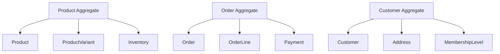

# 第二十五章：完整案例實戰 - 電商 SaaS 系統

## 25.1 引言：從零到生產

本章將帶您完成一個真實的電商 SaaS 系統，從需求分析到生產部署。這個案例整合了前面 24 章的所有知識點。

### 1. 系統概述

- **名稱**：CloudShop - 多租戶電商平台
- **目標**：為中小企業提供開箱即用的電商解決方案
- **技術棧**：ABP Framework 10.0, .NET 10.0, PostgreSQL, Redis, RabbitMQ, Kubernetes
- **預期規模**：支援 1000+ 租戶,每租戶 10,000+ 商品

---

## 25.2 需求分析

### 1. 功能需求

- **商品管理**：CRUD、分類、庫存追蹤
- **訂單管理**：購物車、下單、支付、物流追蹤
- **會員系統**：註冊、登入、會員等級
- **多租戶**：每個商家獨立資料、獨立域名
- **報表**：銷售報表、庫存報表

### 2. 非功能需求

- **效能**：API 回應時間 < 200ms (P95)
- **可用性**：99.9% uptime
- **擴展性**：支援水平擴展
- **安全性**：符合 GDPR、PCI DSS

---

## 25.3 架構設計

### 1. 領域模型 (DDD)



### 2. 模組劃分

```
CloudShop/
├── Catalog Module (商品目錄)
├── Ordering Module (訂單)
├── Payment Module (支付)
├── Identity Module (身分認證)
└── Reporting Module (報表)
```

---

## 25.4 實作：商品聚合 (Product Aggregate)

### 1. 領域層

```csharp
public class Product : FullAuditedAggregateRoot<Guid>, IMultiTenant
{
    public Guid? TenantId { get; set; }
    public string Name { get; private set; }
    public string SKU { get; private set; }
    public decimal Price { get; private set; }
    public ProductStatus Status { get; private set; }
    public List<ProductVariant> Variants { get; private set; } = new();
    public Inventory Inventory { get; private set; }

    private Product() { }

    public Product(Guid id, string name, string sku, decimal price) : base(id)
    {
        SetName(name);
        SetSKU(sku);
        SetPrice(price);
        Status = ProductStatus.Draft;
        Inventory = new Inventory(0);
    }

    public void SetName(string name)
    {
        Name = Check.NotNullOrWhiteSpace(name, nameof(name), ProductConsts.MaxNameLength);
    }

    public void SetPrice(decimal price)
    {
        if (price < 0)
            throw new BusinessException("CloudShop:NegativePrice");
        Price = price;
    }

    public void Publish()
    {
        if (Inventory.Quantity <= 0)
            throw new BusinessException("CloudShop:CannotPublishWithoutStock");

        Status = ProductStatus.Published;
        AddDomainEvent(new ProductPublishedEvent(Id));
    }

    public void AddVariant(string name, decimal priceAdjustment)
    {
        Variants.Add(new ProductVariant(Guid.NewGuid(), name, priceAdjustment));
    }

    public void AdjustInventory(int quantity)
    {
        Inventory.Adjust(quantity);

        if (Inventory.Quantity <= 0 && Status == ProductStatus.Published)
        {
            Status = ProductStatus.OutOfStock;
            AddDomainEvent(new ProductOutOfStockEvent(Id));
        }
    }
}

public class Inventory : ValueObject
{
    public int Quantity { get; private set; }

    public Inventory(int quantity)
    {
        Quantity = quantity;
    }

    public void Adjust(int delta)
    {
        Quantity += delta;
        if (Quantity < 0)
            throw new BusinessException("CloudShop:NegativeInventory");
    }

    protected override IEnumerable<object> GetAtomicValues()
    {
        yield return Quantity;
    }
}
```

### 2. 應用層

```csharp
public class ProductAppService : ApplicationService, IProductAppService
{
    private readonly IRepository<Product, Guid> _productRepository;
    private readonly IDistributedCache<ProductDto> _cache;

    [Authorize("CloudShop.Products.Create")]
    public async Task<ProductDto> CreateAsync(CreateProductDto input)
    {
        var product = new Product(
            GuidGenerator.Create(),
            input.Name,
            input.SKU,
            input.Price
        );

        foreach (var variant in input.Variants)
        {
            product.AddVariant(variant.Name, variant.PriceAdjustment);
        }

        await _productRepository.InsertAsync(product);
        return ObjectMapper.Map<Product, ProductDto>(product);
    }

    public async Task<ProductDto> GetAsync(Guid id)
    {
        // 快取策略
        var cacheKey = $"Product:{id}";
        var cached = await _cache.GetAsync(cacheKey);
        if (cached != null) return cached;

        var product = await _productRepository.GetAsync(id);
        var dto = ObjectMapper.Map<Product, ProductDto>(product);

        await _cache.SetAsync(cacheKey, dto, new DistributedCacheEntryOptions
        {
            AbsoluteExpirationRelativeToNow = TimeSpan.FromMinutes(10)
        });

        return dto;
    }

    [Authorize("CloudShop.Products.Publish")]
    public async Task PublishAsync(Guid id)
    {
        var product = await _productRepository.GetAsync(id);
        product.Publish();
        await _productRepository.UpdateAsync(product);

        // 清除快取
        await _cache.RemoveAsync($"Product:{id}");
    }
}
```

---

## 25.5 實作：訂單聚合 (Order Aggregate)

```csharp
public class Order : FullAuditedAggregateRoot<Guid>, IMultiTenant
{
    public Guid? TenantId { get; set; }
    public string OrderNumber { get; private set; }
    public Guid CustomerId { get; private set; }
    public OrderStatus Status { get; private set; }
    public List<OrderLine> Lines { get; private set; } = new();
    public decimal TotalAmount { get; private set; }
    public Address ShippingAddress { get; private set; }

    public void AddLine(Guid productId, string productName, int quantity, decimal unitPrice)
    {
        if (Status != OrderStatus.Draft)
            throw new BusinessException("CloudShop:CannotModifyNonDraftOrder");

        var existingLine = Lines.FirstOrDefault(l => l.ProductId == productId);
        if (existingLine != null)
        {
            existingLine.IncreaseQuantity(quantity);
        }
        else
        {
            Lines.Add(new OrderLine(productId, productName, quantity, unitPrice));
        }

        RecalculateTotal();
    }

    public void Submit()
    {
        if (Lines.Count == 0)
            throw new BusinessException("CloudShop:EmptyOrder");

        Status = OrderStatus.Submitted;
        AddDomainEvent(new OrderSubmittedEvent(Id, CustomerId, TotalAmount));
    }

    private void RecalculateTotal()
    {
        TotalAmount = Lines.Sum(l => l.Quantity * l.UnitPrice);
    }
}
```

---

## 25.6 多租戶實作

### 1. 租戶解析

```csharp
public class DomainTenantResolveContributor : TenantResolveContributorBase
{
    public override async Task ResolveAsync(ITenantResolveContext context)
    {
        var httpContext = context.ServiceProvider
            .GetRequiredService<IHttpContextAccessor>()
            .HttpContext;

        if (httpContext == null) return;

        // 從域名解析租戶 (shop1.cloudshop.com -> shop1)
        var host = httpContext.Request.Host.Host;
        var subdomain = host.Split('.').FirstOrDefault();

        if (!string.IsNullOrEmpty(subdomain))
        {
            var tenantStore = context.ServiceProvider.GetRequiredService<ITenantStore>();
            var tenant = await tenantStore.FindByNameAsync(subdomain);

            if (tenant != null)
            {
                context.TenantIdOrName = tenant.Id.ToString();
            }
        }
    }
}
```

### 2. 租戶初始化

```csharp
public class TenantInitializationService : ITransientDependency
{
    public async Task InitializeAsync(Guid tenantId, string adminEmail, string adminPassword)
    {
        using (_currentTenant.Change(tenantId))
        {
            // 1. 執行資料庫遷移
            await _dbContext.Database.MigrateAsync();

            // 2. 建立預設角色
            await CreateDefaultRolesAsync();

            // 3. 建立管理員
            await CreateAdminUserAsync(adminEmail, adminPassword);

            // 4. 設定 Features
            await SetupFeaturesAsync(tenantId);

            // 5. 建立示範資料
            await SeedSampleDataAsync();
        }
    }
}
```

---

## 25.7 部署配置

### 1. Docker Compose (開發環境)

```yaml
version: "3.8"

services:
  web:
    build: .
    ports:
      - "8080:8080"
    environment:
      - ConnectionStrings__Default=Host=postgres;Database=CloudShop;Username=postgres;Password=postgres
      - Redis__Configuration=redis:6379
      - RabbitMQ__Host=rabbitmq
    depends_on:
      - postgres
      - redis
      - rabbitmq

  postgres:
    image: postgres:16-alpine
    environment:
      - POSTGRES_PASSWORD=postgres
    volumes:
      - postgres-data:/var/lib/postgresql/data

  redis:
    image: redis:7-alpine

  rabbitmq:
    image: rabbitmq:3-management-alpine
    ports:
      - "15672:15672"

volumes:
  postgres-data:
```

### 2. Kubernetes (生產環境)

```yaml
apiVersion: apps/v1
kind: Deployment
metadata:
  name: cloudshop-web
spec:
  replicas: 5
  selector:
    matchLabels:
      app: cloudshop
  template:
    spec:
      containers:
        - name: web
          image: myregistry/cloudshop:1.0.0
          resources:
            requests:
              memory: "512Mi"
              cpu: "500m"
            limits:
              memory: "1Gi"
              cpu: "1000m"
          livenessProbe:
            httpGet:
              path: /health/live
              port: 8080
            initialDelaySeconds: 30
          readinessProbe:
            httpGet:
              path: /health/ready
              port: 8080
            initialDelaySeconds: 5
---
apiVersion: autoscaling/v2
kind: HorizontalPodAutoscaler
metadata:
  name: cloudshop-hpa
spec:
  scaleTargetRef:
    apiVersion: apps/v1
    kind: Deployment
    name: cloudshop-web
  minReplicas: 3
  maxReplicas: 20
  metrics:
    - type: Resource
      resource:
        name: cpu
        target:
          type: Utilization
          averageUtilization: 70
```

---

## 25.8 總結與最佳實踐

### 1. 架構決策

- **DDD**：清晰的聚合邊界，業務邏輯封裝在領域層
- **多租戶**：Database per Tenant 策略，確保資料隔離
- **快取**：Redis 分散式快取，減少資料庫壓力
- **事件驅動**：RabbitMQ 解耦服務間通訊

### 2. 開發流程

1.  需求分析 → 領域建模
2.  實作領域層 → 撰寫單元測試
3.  實作應用層 → 撰寫整合測試
4.  實作 UI → E2E 測試
5.  部署到 Staging → 驗證
6.  部署到 Production

### 3. 運維要點

- **監控**：Application Insights + Prometheus
- **日誌**：Serilog + Seq
- **告警**：CPU > 80%, Memory > 85%, Error Rate > 1%
- **備份**：每日自動備份資料庫

---

## 25.9 課程總結

恭喜您完成了 ABP Framework V10.0 開源社群版的完整學習！

您現在已經掌握：

- ✅ ABP 核心概念與模組系統
- ✅ DDD 領域驅動設計
- ✅ 多租戶 SaaS 架構
- ✅ 效能優化與安全性
- ✅ 容器化與 Kubernetes 部署
- ✅ 完整的企業級應用開發能力

### 下一步建議

1.  **實踐**：建立您自己的專案
2.  **貢獻**：參與 ABP 或 EasyAbp 社群
3.  **深入**：研讀 DDD、微服務相關書籍
4.  **分享**：將您的經驗分享給其他開發者

---

**參考資源**：

- [ABP 官方文件](https://docs.abp.io/)
- [ABP GitHub](https://github.com/abpframework/abp)
- [EasyAbp 社群](https://github.com/EasyAbp)
- [ABP 中文社群](https://abp.io/community)

**感謝您的學習，祝您開發順利！**
