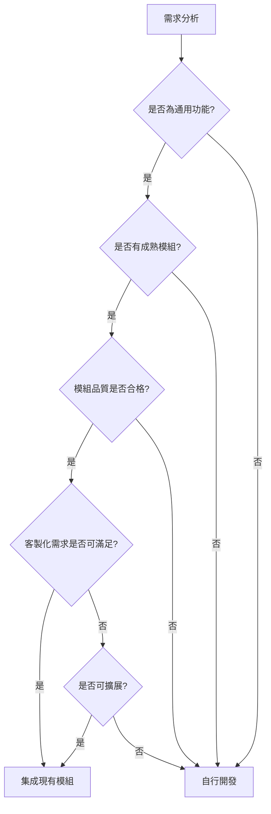
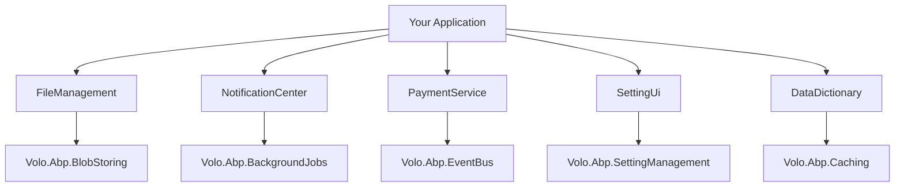

# 第二十四章：社群熱門開源模組整合 - 習題解答

本文件提供第二十四章習題的完整解答，涵蓋模組評估、整合方案設計和實作。

---

## 概念題

### 題目 1：評估社群模組品質的關鍵指標為何？（難度：易）

#### 解答

評估社群模組品質的關鍵指標包括：

1. **活躍度指標**：

   - 最後更新時間（建議 6 個月內有更新）
   - Issue 回應速度（建議 48 小時內回應）
   - Pull Request 合併頻率
   - Commit 頻率

2. **相容性指標**：

   - 支援的 ABP Framework 版本
   - 支援的 .NET 版本
   - 資料庫相容性
   - 瀏覽器相容性（UI 模組）

3. **品質指標**：

   - GitHub Star 數量（參考指標）
   - Fork 數量
   - 開放 Issue 數量 vs 已關閉 Issue 數量
   - 單元測試覆蓋率
   - 程式碼品質（使用 SonarQube 等工具分析）

4. **文件指標**：

   - README 完整性
   - API 文件
   - 使用範例
   - 變更日誌（CHANGELOG）
   - 遷移指南

5. **社群支援**：

   - 維護者回應態度
   - 社群討論活躍度
   - 是否有官方支援
   - 是否有付費支援選項

6. **授權條款**：
   - 開源授權類型（MIT, Apache 2.0 等）
   - 商業使用限制
   - 授權相容性

**評估範例**：

```bash
# 檢查 GitHub 倉庫
# 查看：
# - Stars: > 100 (較受歡迎)
# - Last commit: < 6 months (活躍維護)
# - Open issues: < 50 (問題處理良好)
# - License: MIT/Apache 2.0 (商業友善)

# 檢查 NuGet
dotnet package search EasyAbp.DataDictionary
# 查看：
# - Downloads: > 10,000 (使用廣泛)
# - Latest version date (版本更新頻率)
```

---

### 題目 2：何時應選擇集成現有模組 vs 自行開發？（難度：中）

#### 解答

**選擇集成現有模組的情況**：

1. **功能標準化**：

   - 需求是通用功能（如檔案管理、通知系統）
   - 業界有成熟的解決方案
   - 不需要深度客製化

2. **時間壓力**：

   - 專案時程緊迫
   - 需要快速上線
   - 團隊資源有限

3. **成本考量**：

   - 開發成本高於整合成本
   - 維護成本可接受
   - 有預算限制

4. **品質保證**：
   - 模組經過大量使用者驗證
   - 有完整的測試覆蓋
   - 安全性經過審查

**選擇自行開發的情況**：

1. **特殊需求**：

   - 業務邏輯高度客製化
   - 現有模組無法滿足需求
   - 需要完全控制實作細節

2. **長期考量**：

   - 核心業務功能，需要長期維護
   - 不希望依賴第三方
   - 需要深度整合到系統中

3. **效能要求**：

   - 現有模組效能不符合要求
   - 需要極致優化
   - 有特殊的效能指標

4. **安全性**：
   - 處理敏感資料
   - 需要符合特定合規要求
   - 不信任第三方程式碼

**決策矩陣**：

| 因素       | 權重 | 集成模組          | 自行開發    |
| ---------- | ---- | ----------------- | ----------- |
| 開發時間   | 高   | ✅ 快速           | ❌ 緩慢     |
| 開發成本   | 高   | ✅ 低             | ❌ 高       |
| 客製化程度 | 中   | ❌ 受限           | ✅ 完全控制 |
| 維護成本   | 中   | ⚠️ 依賴第三方     | ⚠️ 自行維護 |
| 安全性     | 高   | ⚠️ 需審查         | ✅ 完全掌控 |
| 功能完整性 | 中   | ⚠️ 可能過度或不足 | ✅ 精確匹配 |

**建議流程**：



---

## 計算/練習題

### 題目 3：設計一個包含 5 個社群模組的整合方案，識別相依性與風險。（難度：中）

#### 解答

**場景**：為一個電商平台設計模組整合方案

**選定的 5 個模組**：

1. **EasyAbp.FileManagement** - 檔案管理
2. **EasyAbp.NotificationCenter** - 通知中心
3. **EasyAbp.PaymentService** - 支付整合
4. **EasyAbp.Abp.SettingUi** - 設定管理 UI
5. **EasyAbp.Abp.DataDictionary** - 資料字典

**相依性分析**：



**版本相容性矩陣**：

| 模組               | ABP 版本 | .NET 版本 | 其他相依性              |
| ------------------ | -------- | --------- | ----------------------- |
| FileManagement     | 9.3.x    | .NET 9.0  | BlobStoring             |
| NotificationCenter | 9.3.x    | .NET 9.0  | BackgroundJobs, SignalR |
| PaymentService     | 9.3.x    | .NET 9.0  | EventBus                |
| SettingUi          | 9.3.x    | .NET 9.0  | SettingManagement       |
| DataDictionary     | 9.3.x    | .NET 9.0  | Caching                 |

**風險識別與緩解策略**：

1. **版本衝突風險** (高)

   - **風險**：不同模組可能依賴不同版本的 ABP 核心套件
   - **緩解**：
     - 使用 `Directory.Packages.props` 統一版本管理
     - 選擇相同 ABP 版本的模組
     - 建立測試環境驗證相容性

2. **功能重疊風險** (中)

   - **風險**：NotificationCenter 和 PaymentService 可能都有通知功能
   - **緩解**：
     - 明確定義各模組的職責邊界
     - 使用配置禁用重疊功能
     - 建立統一的通知介面

3. **效能風險** (中)

   - **風險**：多個模組同時使用快取和背景任務可能影響效能
   - **緩解**：
     - 配置獨立的 Redis 實例
     - 設定合理的快取過期時間
     - 監控資源使用情況

4. **維護風險** (高)

   - **風險**：5 個模組需要分別追蹤更新
   - **緩解**：
     - 建立模組更新檢查機制
     - 使用 Dependabot 自動追蹤更新
     - 建立完整的測試套件

5. **學習曲線風險** (中)
   - **風險**：團隊需要學習 5 個模組的 API
   - **緩解**：
     - 建立內部文件
     - 進行團隊培訓
     - 建立範例程式碼庫

**整合方案**：

```xml
<!-- Directory.Packages.props -->
<Project>
  <PropertyGroup>
    <ManagePackageVersionsCentrally>true</ManagePackageVersionsCentrally>
  </PropertyGroup>

  <ItemGroup>
    <!-- ABP Framework -->
    <PackageVersion Include="Volo.Abp" Version="9.3.0" />
    <PackageVersion Include="Volo.Abp.BlobStoring" Version="9.3.0" />
    <PackageVersion Include="Volo.Abp.BackgroundJobs" Version="9.3.0" />
    <PackageVersion Include="Volo.Abp.EventBus" Version="9.3.0" />
    <PackageVersion Include="Volo.Abp.SettingManagement" Version="9.3.0" />
    <PackageVersion Include="Volo.Abp.Caching" Version="9.3.0" />

    <!-- EasyAbp Modules -->
    <PackageVersion Include="EasyAbp.FileManagement.Domain" Version="6.0.0" />
    <PackageVersion Include="EasyAbp.NotificationCenter.Domain" Version="2.0.0" />
    <PackageVersion Include="EasyAbp.PaymentService.Domain" Version="3.0.0" />
    <PackageVersion Include="EasyAbp.Abp.SettingUi.Domain" Version="5.0.0" />
    <PackageVersion Include="EasyAbp.Abp.DataDictionary.Domain" Version="2.0.0" />
  </ItemGroup>
</Project>
```

---

### 題目 4：制定模組升級計畫：現有 5 個模組，評估升級順序與風險。（難度：中）

#### 解答

**現況**：

- FileManagement: v5.0.0 → v6.0.0 (有破壞性變更)
- NotificationCenter: v1.5.0 → v2.0.0 (有破壞性變更)
- PaymentService: v2.8.0 → v3.0.0 (有破壞性變更)
- SettingUi: v4.9.0 → v5.0.0 (有破壞性變更)
- DataDictionary: v1.9.0 → v2.0.0 (有破壞性變更)

**升級順序評估**：

1. **相依性分析**：

   ```
   DataDictionary (獨立) - 優先級 1
   SettingUi (獨立) - 優先級 1
   FileManagement (獨立) - 優先級 2
   NotificationCenter (依賴 BackgroundJobs) - 優先級 3
   PaymentService (依賴 EventBus, NotificationCenter) - 優先級 4
   ```

2. **風險評估矩陣**：

| 模組               | 使用頻率 | 破壞性變更影響 | 測試覆蓋率 | 風險等級 |
| ------------------ | -------- | -------------- | ---------- | -------- |
| DataDictionary     | 低       | 低             | 高         | 低       |
| SettingUi          | 低       | 中             | 中         | 低       |
| FileManagement     | 高       | 高             | 高         | 中       |
| NotificationCenter | 高       | 高             | 中         | 高       |
| PaymentService     | 極高     | 極高           | 高         | 極高     |

**升級計畫**：

**階段 1：低風險模組（第 1-2 週）**

```bash
# 1. DataDictionary
dotnet add package EasyAbp.Abp.DataDictionary.Domain --version 2.0.0

# 檢查破壞性變更
# - API 變更：GetByCode() → GetByCodeAsync()
# - 配置變更：CacheDuration 改為 CacheOptions

# 修改程式碼
# Before:
var dict = _dictionaryService.GetByCode("Status");
# After:
var dict = await _dictionaryService.GetByCodeAsync("Status");

# 執行測試
dotnet test --filter "Category=DataDictionary"

# 部署到 Staging
# 驗證功能正常

# 2. SettingUi (同樣流程)
```

**階段 2：中風險模組（第 3-4 週）**

```bash
# 3. FileManagement
dotnet add package EasyAbp.FileManagement.Domain --version 6.0.0

# 破壞性變更：
# - FileDescriptor 改為 FileInfo
# - 上傳 API 參數變更

# 建立相容層
public class FileManagementCompatibilityService
{
    public async Task<FileInfo> UploadAsync(Stream stream, string fileName)
    {
        // 新 API 包裝
        return await _fileManager.CreateAsync(new CreateFileInput
        {
            Stream = stream,
            FileName = fileName
        });
    }
}

# 逐步遷移呼叫點
# 執行完整測試
# 部署到 Staging 並進行壓力測試
```

**階段 3：高風險模組（第 5-6 週）**

```bash
# 4. NotificationCenter
# 破壞性變更：
# - 通知模板系統重構
# - SignalR Hub 路徑變更

# 準備工作：
# - 備份現有通知模板
# - 建立遷移腳本
# - 準備回滾方案

# 執行升級
dotnet add package EasyAbp.NotificationCenter.Domain --version 2.0.0

# 遷移通知模板
dotnet run --project src/MyProject.DbMigrator -- --migrate-notifications

# 測試：
# - 單元測試
# - 整合測試
# - E2E 測試（發送通知、接收通知）

# 灰度發布：
# - 10% 使用者使用新版本
# - 監控錯誤率
# - 逐步擴大到 100%
```

**階段 4：極高風險模組（第 7-8 週）**

```bash
# 5. PaymentService
# 破壞性變更：
# - 支付閘道介面重構
# - 回調處理機制變更
# - 退款流程變更

# 準備工作：
# - 與支付閘道供應商確認相容性
# - 建立完整的測試環境（包含測試支付閘道）
# - 準備詳細的回滾計畫
# - 通知所有相關團隊

# 升級策略：藍綠部署
# 1. 部署新版本到綠色環境
# 2. 在綠色環境進行完整測試
# 3. 切換流量到綠色環境
# 4. 監控 24 小時
# 5. 若無問題，移除藍色環境

# 監控指標：
# - 支付成功率
# - 支付延遲
# - 錯誤率
# - 回調成功率
```

**風險緩解措施**：

1. **建立回滾機制**：

   ```bash
   # 每個階段都準備回滾腳本
   # rollback-stage1.sh
   dotnet add package EasyAbp.Abp.DataDictionary.Domain --version 1.9.0
   dotnet ef database update PreviousMigration
   ```

2. **建立監控告警**：

   ```csharp
   // 升級後監控關鍵指標
   services.AddHealthChecks()
       .AddCheck<DataDictionaryHealthCheck>("datadictionary")
       .AddCheck<NotificationHealthCheck>("notification")
       .AddCheck<PaymentHealthCheck>("payment");
   ```

3. **建立測試檢查清單**：
   - [ ] 單元測試通過
   - [ ] 整合測試通過
   - [ ] E2E 測試通過
   - [ ] 效能測試通過
   - [ ] 安全掃描通過
   - [ ] Staging 環境驗證通過
   - [ ] 文件更新完成

---

## 實作/編碼題

### 題目 5：安裝並集成 3 個社群模組，並實作模組間協作。（難度：較難）

#### 解答

**目標**：整合 DataDictionary、FileManagement、NotificationCenter 三個模組，實作一個文件審批系統。

**步驟 1：安裝模組**

```bash
# 安裝 DataDictionary
dotnet add src/MyProject.Domain package EasyAbp.Abp.DataDictionary.Domain
dotnet add src/MyProject.Application package EasyAbp.Abp.DataDictionary.Application
dotnet add src/MyProject.EntityFrameworkCore package EasyAbp.Abp.DataDictionary.EntityFrameworkCore
dotnet add src/MyProject.HttpApi package EasyAbp.Abp.DataDictionary.HttpApi

# 安裝 FileManagement
dotnet add src/MyProject.Domain package EasyAbp.FileManagement.Domain
dotnet add src/MyProject.Application package EasyAbp.FileManagement.Application
dotnet add src/MyProject.EntityFrameworkCore package EasyAbp.FileManagement.EntityFrameworkCore
dotnet add src/MyProject.HttpApi package EasyAbp.FileManagement.HttpApi

# 安裝 NotificationCenter
dotnet add src/MyProject.Domain package EasyAbp.NotificationCenter.Domain
dotnet add src/MyProject.Application package EasyAbp.NotificationCenter.Application
dotnet add src/MyProject.EntityFrameworkCore package EasyAbp.NotificationCenter.EntityFrameworkCore
dotnet add src/MyProject.HttpApi package EasyAbp.NotificationCenter.HttpApi
```

**步驟 2：配置模組依賴**

```csharp
// MyProjectDomainModule.cs
[DependsOn(
    typeof(DataDictionaryDomainModule),
    typeof(FileManagementDomainModule),
    typeof(NotificationCenterDomainModule)
)]
public class MyProjectDomainModule : AbpModule
{
}

// MyProjectApplicationModule.cs
[DependsOn(
    typeof(DataDictionaryApplicationModule),
    typeof(FileManagementApplicationModule),
    typeof(NotificationCenterApplicationModule)
)]
public class MyProjectApplicationModule : AbpModule
{
}

// MyProjectEntityFrameworkCoreModule.cs
[DependsOn(
    typeof(DataDictionaryEntityFrameworkCoreModule),
    typeof(FileManagementEntityFrameworkCoreModule),
    typeof(NotificationCenterEntityFrameworkCoreModule)
)]
public class MyProjectEntityFrameworkCoreModule : AbpModule
{
    public override void ConfigureServices(ServiceConfigurationContext context)
    {
        context.Services.AddAbpDbContext<MyProjectDbContext>(options =>
        {
            options.AddDefaultRepositories(includeAllEntities: true);

            // 配置模組的 DbContext
            options.AddRepository<DataDictionary, EfCoreDataDictionaryRepository>();
            options.AddRepository<File, EfCoreFileRepository>();
            options.AddRepository<Notification, EfCoreNotificationRepository>();
        });
    }
}
```

**步驟 3：建立 Migration**

```bash
dotnet ef migrations add AddedThreeModules -p src/MyProject.EntityFrameworkCore
dotnet ef database update -p src/MyProject.EntityFrameworkCore
```

**步驟 4：實作文件審批系統**

```csharp
// Domain/DocumentApproval/DocumentApproval.cs
public class DocumentApproval : FullAuditedAggregateRoot<Guid>
{
    public string Title { get; set; }
    public Guid FileId { get; set; } // FileManagement 模組的檔案 ID
    public ApprovalStatus Status { get; set; }
    public Guid SubmitterId { get; set; }
    public Guid? ApproverId { get; set; }
    public DateTime? ApprovedTime { get; set; }
    public string Comment { get; set; }

    public void Submit()
    {
        Status = ApprovalStatus.Pending;
        AddDomainEvent(new DocumentSubmittedEvent(Id, SubmitterId, FileId));
    }

    public void Approve(Guid approverId, string comment)
    {
        Status = ApprovalStatus.Approved;
        ApproverId = approverId;
        ApprovedTime = DateTime.UtcNow;
        Comment = comment;
        AddDomainEvent(new DocumentApprovedEvent(Id, SubmitterId, approverId));
    }

    public void Reject(Guid approverId, string comment)
    {
        Status = ApprovalStatus.Rejected;
        ApproverId = approverId;
        Comment = comment;
        AddDomainEvent(new DocumentRejectedEvent(Id, SubmitterId, approverId, comment));
    }
}

public enum ApprovalStatus
{
    Draft,
    Pending,
    Approved,
    Rejected
}
```

**步驟 5：實作 Application Service（整合三個模組）**

```csharp
// Application/DocumentApproval/DocumentApprovalAppService.cs
public class DocumentApprovalAppService : ApplicationService
{
    private readonly IRepository<DocumentApproval, Guid> _approvalRepository;
    private readonly IFileAppService _fileService; // FileManagement
    private readonly IDataDictionaryAppService _dictionaryService; // DataDictionary
    private readonly INotificationAppService _notificationService; // NotificationCenter

    public async Task<DocumentApprovalDto> CreateAsync(CreateDocumentApprovalDto input)
    {
        // 1. 上傳檔案（使用 FileManagement）
        var file = await _fileService.CreateAsync(new CreateFileInput
        {
            FileName = input.FileName,
            Content = input.FileContent
        });

        // 2. 建立審批記錄
        var approval = new DocumentApproval
        {
            Id = GuidGenerator.Create(),
            Title = input.Title,
            FileId = file.Id,
            SubmitterId = CurrentUser.Id.Value,
            Status = ApprovalStatus.Draft
        };

        await _approvalRepository.InsertAsync(approval);

        return ObjectMapper.Map<DocumentApproval, DocumentApprovalDto>(approval);
    }

    public async Task SubmitAsync(Guid id)
    {
        var approval = await _approvalRepository.GetAsync(id);
        approval.Submit();
        await _approvalRepository.UpdateAsync(approval);

        // 發送通知給審批者（使用 NotificationCenter）
        var approvers = await GetApproversAsync();
        foreach (var approver in approvers)
        {
            await _notificationService.SendAsync(new SendNotificationInput
            {
                RecipientId = approver.Id,
                Title = "新的文件待審批",
                Content = $"文件「{approval.Title}」需要您的審批",
                Type = "DocumentApproval",
                Data = new { ApprovalId = approval.Id }
            });
        }
    }

    public async Task ApproveAsync(Guid id, ApproveDocumentDto input)
    {
        var approval = await _approvalRepository.GetAsync(id);
        approval.Approve(CurrentUser.Id.Value, input.Comment);
        await _approvalRepository.UpdateAsync(approval);

        // 發送通知給提交者
        await _notificationService.SendAsync(new SendNotificationInput
        {
            RecipientId = approval.SubmitterId,
            Title = "文件已核准",
            Content = $"您的文件「{approval.Title}」已被核准",
            Type = "DocumentApproved"
        });
    }

    public async Task<List<SelectListItem>> GetApprovalStatusOptionsAsync()
    {
        // 使用 DataDictionary 獲取審批狀態選項
        var statuses = await _dictionaryService.GetListAsync("ApprovalStatus");
        return statuses.Select(s => new SelectListItem
        {
            Value = s.Code,
            Text = s.DisplayText
        }).ToList();
    }
}
```

**步驟 6：實作事件處理器（模組間協作）**

```csharp
// Application/DocumentApproval/DocumentEventHandler.cs
public class DocumentEventHandler :
    ILocalEventHandler<DocumentSubmittedEvent>,
    ILocalEventHandler<DocumentApprovedEvent>,
    ILocalEventHandler<DocumentRejectedEvent>,
    ITransientDependency
{
    private readonly INotificationAppService _notificationService;
    private readonly ILogger<DocumentEventHandler> _logger;

    public async Task HandleEventAsync(DocumentSubmittedEvent eventData)
    {
        _logger.LogInformation("Document {DocumentId} submitted", eventData.DocumentId);

        // 記錄到審計日誌
        // 發送通知已在 AppService 中處理
    }

    public async Task HandleEventAsync(DocumentApprovedEvent eventData)
    {
        _logger.LogInformation("Document {DocumentId} approved by {ApproverId}",
            eventData.DocumentId, eventData.ApproverId);

        // 可以在這裡觸發後續流程
        // 例如：自動歸檔文件、更新統計資料等
    }

    public async Task HandleEventAsync(DocumentRejectedEvent eventData)
    {
        _logger.LogWarning("Document {DocumentId} rejected: {Reason}",
            eventData.DocumentId, eventData.Reason);
    }
}
```

**步驟 7：建立 UI（Razor Pages 範例）**

```html
<!-- Pages/DocumentApproval/Create.cshtml -->
@page @model CreateModel

<h2>提交文件審批</h2>

<form method="post" enctype="multipart/form-data">
  <div class="mb-3">
    <label>標題</label>
    <input asp-for="Input.Title" class="form-control" />
  </div>

  <div class="mb-3">
    <label>選擇檔案</label>
    <input type="file" name="file" class="form-control" />
  </div>

  <div class="mb-3">
    <label>審批類型</label>
    <select asp-for="Input.ApprovalType" class="form-select">
      @foreach (var option in Model.ApprovalTypeOptions) {
      <option value="@option.Value">@option.Text</option>
      }
    </select>
  </div>

  <button type="submit" class="btn btn-primary">提交審批</button>
</form>
```

```csharp
// Pages/DocumentApproval/Create.cshtml.cs
public class CreateModel : PageModel
{
    private readonly IDocumentApprovalAppService _approvalService;

    [BindProperty]
    public CreateDocumentApprovalInput Input { get; set; }

    public List<SelectListItem> ApprovalTypeOptions { get; set; }

    public async Task OnGetAsync()
    {
        // 使用 DataDictionary 載入選項
        ApprovalTypeOptions = await _approvalService.GetApprovalStatusOptionsAsync();
    }

    public async Task<IActionResult> OnPostAsync(IFormFile file)
    {
        if (file == null || file.Length == 0)
        {
            ModelState.AddModelError("", "請選擇檔案");
            return Page();
        }

        using var stream = file.OpenReadStream();
        var bytes = new byte[file.Length];
        await stream.ReadAsync(bytes);

        Input.FileName = file.FileName;
        Input.FileContent = bytes;

        var result = await _approvalService.CreateAsync(Input);
        await _approvalService.SubmitAsync(result.Id);

        return RedirectToPage("./Index");
    }
}
```

---

### 題目 6：為社群模組編寫完整集成測試。（難度：較難）

#### 解答

```csharp
// Test/Integration/DocumentApprovalIntegrationTests.cs
using System;
using System.Threading.Tasks;
using EasyAbp.Abp.DataDictionary;
using EasyAbp.FileManagement;
using EasyAbp.NotificationCenter;
using Shouldly;
using Xunit;

namespace MyProject.DocumentApproval
{
    public class DocumentApprovalIntegrationTests : MyProjectApplicationTestBase
    {
        private readonly IDocumentApprovalAppService _approvalService;
        private readonly IFileAppService _fileService;
        private readonly INotificationAppService _notificationService;
        private readonly IDataDictionaryAppService _dictionaryService;

        public DocumentApprovalIntegrationTests()
        {
            _approvalService = GetRequiredService<IDocumentApprovalAppService>();
            _fileService = GetRequiredService<IFileAppService>();
            _notificationService = GetRequiredService<INotificationAppService>();
            _dictionaryService = GetRequiredService<IDataDictionaryAppService>();
        }

        [Fact]
        public async Task Should_Create_Approval_With_File()
        {
            // Arrange
            var input = new CreateDocumentApprovalDto
            {
                Title = "測試文件",
                FileName = "test.pdf",
                FileContent = new byte[] { 1, 2, 3, 4, 5 }
            };

            // Act
            var result = await _approvalService.CreateAsync(input);

            // Assert
            result.ShouldNotBeNull();
            result.Title.ShouldBe("測試文件");
            result.FileId.ShouldNotBe(Guid.Empty);

            // 驗證檔案確實被建立
            var file = await _fileService.GetAsync(result.FileId);
            file.ShouldNotBeNull();
            file.FileName.ShouldBe("test.pdf");
        }

        [Fact]
        public async Task Should_Send_Notification_When_Submitted()
        {
            // Arrange
            var approval = await CreateTestApprovalAsync();
            var approverUserId = Guid.NewGuid(); // 假設的審批者 ID

            // Act
            await _approvalService.SubmitAsync(approval.Id);

            // Assert
            // 驗證通知是否發送
            var notifications = await _notificationService.GetListAsync(new GetNotificationsInput
            {
                RecipientId = approverUserId
            });

            notifications.Items.ShouldContain(n =>
                n.Type == "DocumentApproval" &&
                n.Title.Contains("新的文件待審批"));
        }

        [Fact]
        public async Task Should_Use_DataDictionary_For_Status_Options()
        {
            // Arrange & Act
            var options = await _approvalService.GetApprovalStatusOptionsAsync();

            // Assert
            options.ShouldNotBeEmpty();
            options.ShouldContain(o => o.Value == "Pending");
            options.ShouldContain(o => o.Value == "Approved");
            options.ShouldContain(o => o.Value == "Rejected");
        }

        [Fact]
        public async Task Complete_Approval_Workflow_Should_Work()
        {
            // Arrange
            var submitterId = Guid.NewGuid();
            var approverId = Guid.NewGuid();

            // Act & Assert
            // 1. 建立
            var approval = await CreateTestApprovalAsync();
            approval.Status.ShouldBe(ApprovalStatus.Draft);

            // 2. 提交
            await _approvalService.SubmitAsync(approval.Id);
            var submitted = await _approvalService.GetAsync(approval.Id);
            submitted.Status.ShouldBe(ApprovalStatus.Pending);

            // 3. 核准
            await _approvalService.ApproveAsync(approval.Id, new ApproveDocumentDto
            {
                Comment = "核准"
            });
            var approved = await _approvalService.GetAsync(approval.Id);
            approved.Status.ShouldBe(ApprovalStatus.Approved);
            approved.ApproverId.ShouldNotBeNull();

            // 4. 驗證通知已發送給提交者
            var notifications = await _notificationService.GetListAsync(new GetNotificationsInput
            {
                RecipientId = submitterId
            });
            notifications.Items.ShouldContain(n => n.Type == "DocumentApproved");
        }

        private async Task<DocumentApprovalDto> CreateTestApprovalAsync()
        {
            return await _approvalService.CreateAsync(new CreateDocumentApprovalDto
            {
                Title = "測試文件",
                FileName = "test.pdf",
                FileContent = new byte[] { 1, 2, 3 }
            });
        }
    }
}
```

---

## 總結

本章習題涵蓋了社群模組整合的完整實務：

1. **模組評估**：學會評估模組品質和選擇合適的模組
2. **整合方案設計**：識別相依性、評估風險、制定升級計畫
3. **實際整合**：安裝、配置、實作模組間協作
4. **測試驗證**：編寫完整的集成測試確保相容性

**最佳實踐**：

- 優先選擇活躍維護的模組
- 使用統一的版本管理
- 建立完整的測試覆蓋
- 制定詳細的升級計畫
- 保持文件更新

---

## 參考資源

- [EasyAbp 官方](https://www.easyabp.io/)
- [ABP 模組開發](https://docs.abp.io/en/abp/latest/Modularity)
- [NuGet 官方](https://www.nuget.org/)
