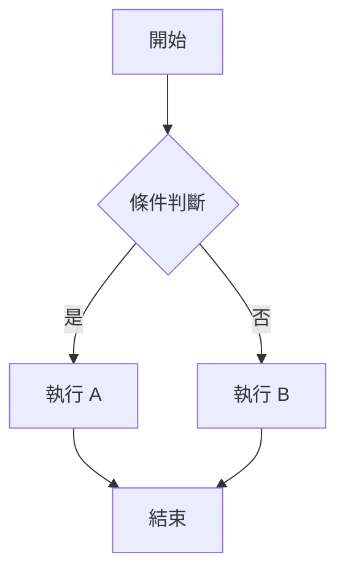
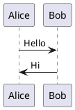
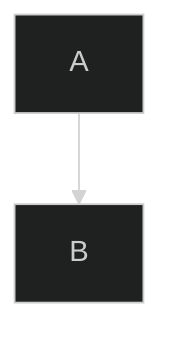
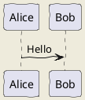

# 圖表渲染說明

## 📊 問題說明

**Pandoc 預設無法直接渲染 Mermaid 和 PlantUML 圖表**。在轉換為 PDF 時，這些圖表代碼會被當作普通的程式碼區塊顯示。

## ✅ 解決方案總覽

| 方案                            | Mermaid 支援 | PlantUML 支援 | 難度 | 推薦度     |
| ------------------------------- | ------------ | ------------- | ---- | ---------- |
| **方案 1：使用 mermaid-filter** | ✅ 自動渲染  | ❌ 需額外配置 | 中   | ⭐⭐⭐⭐⭐ |
| **方案 2：預先生成圖片**        | ✅ 手動      | ✅ 手動       | 低   | ⭐⭐⭐     |
| **方案 3：使用線上工具**        | ✅ 手動      | ✅ 手動       | 低   | ⭐⭐       |

---

## 🎯 方案 1：使用 mermaid-filter（推薦）

### 安裝步驟

```powershell
# 1. 安裝 Node.js（如果尚未安裝）
choco install nodejs

# 2. 安裝 Mermaid CLI
npm install -g @mermaid-js/mermaid-cli

# 3. 安裝 mermaid-filter
npm install -g mermaid-filter

# 4. 驗證安裝
mmdc --version
```

### 使用方法

執行支援圖表渲染的腳本：

```powershell
.\build-pdf-advanced.ps1
```

### 工作原理

```
Markdown 原始檔
    ↓
Pandoc 讀取
    ↓
mermaid-filter 攔截 mermaid 程式碼區塊
    ↓
呼叫 mmdc (Mermaid CLI) 生成 PNG 圖片
    ↓
將圖片嵌入 PDF
    ↓
最終 PDF 輸出（含圖表）
```

### 支援的 Mermaid 圖表類型

- ✅ 流程圖 (Flowchart)
- ✅ 序列圖 (Sequence Diagram)
- ✅ 類別圖 (Class Diagram)
- ✅ 狀態圖 (State Diagram)
- ✅ 實體關係圖 (ER Diagram)
- ✅ 甘特圖 (Gantt Chart)
- ✅ 圓餅圖 (Pie Chart)

### 範例

**Markdown 原始碼：**

````markdown

````

**PDF 中顯示：** 實際的流程圖圖片（自動生成）

---

## 🔧 方案 2：預先生成圖片

適用於 PlantUML 或需要完全控制圖片品質的情況。

### PlantUML 圖片生成

```powershell
# 1. 安裝 Java
choco install openjdk

# 2. 下載 PlantUML
# 訪問 https://plantuml.com/download
# 下載 plantuml.jar 到專案目錄

# 3. 生成圖片
java -jar plantuml.jar your-diagram.puml

# 這會生成 your-diagram.png
```

### 在 Markdown 中引用

````markdown
<!-- 原本的 PlantUML 代碼 -->


````

<!-- 改為引用生成的圖片 -->

```markdown

```

### 批量處理腳本

創建 `generate-diagrams.ps1`：

```powershell
# 批量生成所有 PlantUML 圖表
$pumlFiles = Get-ChildItem -Path "diagrams" -Filter "*.puml" -Recurse

foreach ($file in $pumlFiles) {
    Write-Host "生成圖表: $($file.Name)" -ForegroundColor Cyan
    java -jar plantuml.jar $file.FullName
}

Write-Host "✅ 所有圖表已生成" -ForegroundColor Green
```

---

## 🌐 方案 3：使用線上工具

### Mermaid Live Editor

1. 訪問 https://mermaid.live/
2. 貼上 Mermaid 代碼
3. 點擊「Download PNG」
4. 在 Markdown 中引用下載的圖片

### PlantUML Online Server

1. 訪問 https://www.plantuml.com/plantuml/
2. 貼上 PlantUML 代碼
3. 下載生成的圖片
4. 在 Markdown 中引用

---

## ⚠️ 常見問題

### 問題 1：mermaid-filter 找不到

**錯誤訊息：**

```
Error: pandoc filter mermaid-filter not found
```

**解決方案：**

```powershell
# 重新安裝
npm uninstall -g mermaid-filter
npm install -g mermaid-filter

# 確認安裝位置
npm list -g mermaid-filter
```

### 問題 2：Mermaid 圖表渲染失敗

**錯誤訊息：**

```
Error: Cannot find module 'puppeteer'
```

**解決方案：**

```powershell
# 重新安裝 mermaid-cli
npm uninstall -g @mermaid-js/mermaid-cli
npm cache clean --force
npm install -g @mermaid-js/mermaid-cli
```

### 問題 3：圖表顯示為程式碼

**原因：** mermaid-filter 未正確執行

**解決方案：**

1. 確認 Node.js 已安裝：`node --version`
2. 確認 mmdc 已安裝：`mmdc --version`
3. 確認 mermaid-filter 已安裝：`npm list -g mermaid-filter`
4. 檢查 Pandoc 命令是否包含 `--filter mermaid-filter`

### 問題 4：PlantUML 無法生成圖片

**解決方案：**

```powershell
# 確認 Java 已安裝
java --version

# 測試 PlantUML
java -jar plantuml.jar -testdot

# 如果失敗，安裝 Graphviz
choco install graphviz
```

---

## 📊 效能考量

### Mermaid 圖表渲染時間

- 每個圖表約需 2-5 秒
- 25 個章節，假設有 50 個圖表
- 預計額外時間：5-10 分鐘

### 優化建議

1. **使用快取**：已生成的圖片會被快取，重複執行會更快
2. **分批處理**：先生成部分章節測試
3. **預先生成**：對於複雜圖表，考慮預先生成圖片

---

## 🎨 圖表樣式自訂

### Mermaid 主題

在 Markdown 中指定主題：

````markdown

````

可用主題：

- `default`
- `dark`
- `forest`
- `neutral`

### PlantUML 樣式



---

## 📝 最佳實踐

### 1. 混合使用策略

- **簡單圖表**：使用 Mermaid + mermaid-filter（自動化）
- **複雜圖表**：使用 PlantUML + 預先生成（品質控制）

### 2. 圖片管理

```
project/
├── content/
│   ├── ch01.md
│   └── diagrams/          # 預先生成的圖片
│       ├── ch01-arch.png
│       └── ch02-flow.png
├── build-pdf-advanced.ps1  # 支援 Mermaid 自動渲染
└── generate-diagrams.ps1   # 批量生成 PlantUML
```

### 3. 版本控制

- ✅ 提交 `.puml` 和 `.mmd` 原始檔
- ✅ 提交預先生成的 PNG 圖片
- ❌ 不提交臨時生成的圖片

---

## 🚀 快速開始

### 完整工作流程

```powershell
# 1. 安裝所有必要工具
choco install nodejs openjdk
npm install -g @mermaid-js/mermaid-cli mermaid-filter

# 2. （可選）生成 PlantUML 圖表
.\generate-diagrams.ps1

# 3. 生成 PDF（支援 Mermaid 自動渲染）
.\build-pdf-advanced.ps1

# 4. 檢查輸出
# abp-community-learning-kit_含圖表.pdf
```

---

**最後更新：** 2025 年 11 月 20 日
